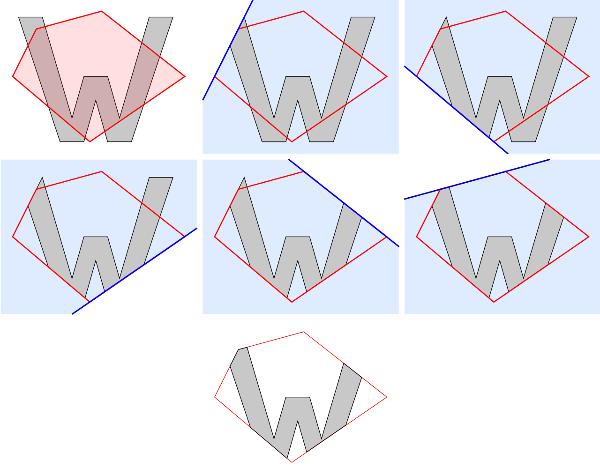

# 基于 Unity 的软光栅化

最近闲暇时基于 Unity 实现了一个软光栅化，之前一直都没有亲自实现过。这次也正好练习一下，顺带熟悉下渲染流程和相关算法。

至于为什么要选在 Unity 中实现呢？因为我对 C++不是很熟悉，懒得折腾了，并且也正好熟悉一下 ComputeShader，而且还有一个优点就是可以直接和 Unity 的渲染结果做对比。

分别实现 CPU Rasterizer（纯 C#）和 GPU Rasterizer（Compute Shader）。

在本文中，我将重点介绍 CPU Rasterizer 的实现，至于 GPU Rasterizer 用的算法都是一样的，这里就不赘述了。源码放在我的[github](https://github.com/csdjk/LcL-Soft-Render)上了，有兴趣的可以看看。

由于篇幅原因以下大部分的算法都不会过于详细的解释以及推导(不会，抄就完事*^▽^*)，但我会提供相关的参考链接和公式推导链接。
并且后面提供的代码也不是完整的，只截取关键部分，完整的代码可以去 github 上查看。

## 准备工作

1. 为了更好的符合图形编程的习惯，这里引入了 Mathematics 库，方便后面的运算中使用 float4、float4x4 等数据类型和“.xyz”等语法。
2. 由于需要读取模型和贴图数据，所以需要开启模型和贴图的读写，这里就简单编写了一个资源导入脚本，导入资源的时候会自动开启读写功能。

```csharp
using UnityEditor;
using UnityEngine;
public class LcLAssetPostprocessor : AssetPostprocessor
{
    void OnPreprocessModel()
    {
        var importer = assetImporter as ModelImporter;
        importer.isReadable = true;
    }

    void OnPreprocessTexture()
    {
        var importer = assetImporter as TextureImporter;
        importer.isReadable = true;
    }
}
```

## 实现

### 渲染流程

在实现之前，我们肯定要熟悉整个渲染流水线，这里贴个简单的流程图，具体细节这里就不赘述了，可以网上查查，或者参考[这篇文章](https://www.lfzxb.top/shader-render-pipeline/)。


### 框架搭建

在这里为了让软光栅化的渲染结果能够显示出来，我使用了 Texture2D 作为渲染目标，并将 ColorBuffer 通过 SetPixels 方法设置到 Texture2D 中。最后通过 GUI.DrawTexture 方法将 Texture2D 绘制到屏幕上。

首先先创建创建一个 IRasterizer 接口，用于定义 CPU 和 GPU Rasterizer 的公共方法。

```csharp
public interface IRasterizer
{
    public abstract Texture ColorTexture { get; }
    public MSAAMode MSAAMode { get; set; }
    public float4x4 MatrixVP { get; }

    public abstract void Render(List<RenderObject> renderObjects);
    public void SetPrimitiveType(PrimitiveType primitiveType);
    public void SetMatrixVP(float4x4 matrixVP);
    public abstract void Clear(CameraClearFlags clearFlags, Color? clearColor = null, float depth = float.PositiveInfinity);
    public abstract void Dispose();
}
```

然后创建一个 CPURasterizer 类,实现 IRasterizer 接口。

创建一个 SoftRenderer 类，用于管理光栅化的相关操作。

```csharp
public class SoftRenderer : MonoBehaviour
{
    public bool active
    {
        get
        {
            return m_Camera.cullingMask == 0;
        }
        set
        {
            m_Camera.cullingMask = value ? 0 : 1;
        }
    }
    public RasterizerType rasterizerType = RasterizerType.CPU;
    public CameraClearFlags clearFlags = CameraClearFlags.Color;
    public Color clearColor = Color.black;
    public PrimitiveType primitiveType = PrimitiveType.Triangle;
    public MSAAMode msaaMode = MSAAMode.None;
    [Range(0.01f, 10)]
    public float frameInterval = 0.1f;
    int m_FrameCount = 0;
    Camera m_Camera;
    IRasterizer m_Rasterizer;
    public IRasterizer rasterizer => m_Rasterizer;
    List<RenderObject> m_RenderObjects = new List<RenderObject>();
    public List<RenderObject> renderObjects => m_RenderObjects;

    public ComputeShader colorComputeShader;
    public static SoftRenderer instance;
    void Awake()
    {
        instance = this;
        Init();
        Render();
    }
    public void Init()
    {
        m_Camera = GetComponent<Camera>();
        if (rasterizerType == RasterizerType.GPUDriven)
            m_Rasterizer = new GPURasterizer(m_Camera, colorComputeShader, msaaMode);
        else
            m_Rasterizer = new CPURasterizer(m_Camera, msaaMode);
        CollectRenderObjects();
    }
    // 收集所有的渲染对象
    public void CollectRenderObjects()
    {
        m_RenderObjects = FindObjectsOfType<RenderObject>().ToList();
        foreach (var obj in m_RenderObjects)
        {
            obj.Init();
        }
        SortRenderObjects();
    }
    public void Render()
    {
        Global.ambientColor = RenderSettings.ambientLight.ToFloat4();
        Global.cameraPosition = m_Camera.transform.position;
        Global.cameraDirection = m_Camera.transform.forward;


        Profiler.BeginSample("LcLSoftRender");
        {
            m_Rasterizer.MSAAMode = msaaMode;
            m_Rasterizer?.Clear(clearFlags, clearColor);

            Matrix4x4 matrixVP = Matrix4x4.identity;
            if (m_Camera.orthographic)
            {
                matrixVP = TransformTool.CreateOrthographicMatrixVP(m_Camera);
            }
            else
            {
                matrixVP = TransformTool.CreateMatrixVP(m_Camera);
            }
            m_Rasterizer?.SetMatrixVP(matrixVP);
            m_Rasterizer?.SetPrimitiveType(primitiveType);

            SortRenderObjects();
            m_Rasterizer?.Render(m_RenderObjects);

        }
        Profiler.EndSample();
    }
    private void OnGUI()
    {
        var texture = m_Rasterizer?.ColorTexture;
        var screenSize = new Vector2(Screen.width, Screen.height);
        if (texture != null && active)
        {
            GUI.DrawTexture(new Rect(0, 0, Screen.width, Screen.height), texture, ScaleMode.ScaleToFit, false);
        }

        if (GUILayout.Button("LcL Render", GUILayout.Width(screenSize.x / 10), GUILayout.Height(screenSize.x / 20)))
        {
            active = true;
            Init();
            Render();
        }
        if (GUILayout.Button("Unity Render", GUILayout.Width(screenSize.x / 10), GUILayout.Height(screenSize.x / 20)))
        {
            active = false;
        }
    }
}

```

SoftRenderer 脚本挂载在摄像机上，读取 Camera 的相关参数，设置一些渲染参数。

- Init 方法用于初始化光栅化器，收集渲染对象，设置渲染参数等。
- CollectRenderObjects 方法用于收集所有的渲染对象（RenderObject）。
- Render 方法用于渲染，这里主要是设置一些全局参数，然后调用光栅化器的相关方法进行渲染。

在 OnGUI 方法中，通过 GUI.DrawTexture 方法将渲染结果绘制到屏幕上。这里还添加了两个按钮，用于切换渲染方式。一个是使用软光栅化渲染，一个是使用 Unity 的渲染。方便对比。


### 计算 MVP 矩阵

创建一个 RenderObject 类，用于存储渲染对象的相关数据。挂载在场景中的物体上。

```csharp
// RenderObject
public void Init()
{
    CalculateMatrix();

    var mesh = GetComponent<MeshFilter>()?.sharedMesh;
    if (mesh == null)
    {
        Debug.LogError("MeshFilter is null");
        return;
    }
    var vertices = mesh.vertices;
    var indices = mesh.triangles;
    var uvs = mesh.uv;
    var normals = mesh.normals;
    var tangents = mesh.tangents;
    var colors = mesh.colors;
    var haveUV = uvs.Length > 0;

    Vertex[] mVertices = new Vertex[vertices.Length];
    if (colors.Length > 0)
    {
        for (int i = 0; i < mVertices.Length; i++)
        {
            mVertices[i] = new Vertex(vertices[i], haveUV ? uvs[i] : 0, normals[i], tangents[i], colors[i]);
        }
    }
    else
    {
        for (int i = 0; i < mVertices.Length; i++)
        {
            mVertices[i] = new Vertex(vertices[i], haveUV ? uvs[i] : 0, normals[i], tangents[i], Color.black);
        }
    }
    m_VertexBuffer = new VertexBuffer(mVertices);
    m_IndexBuffer = new IndexBuffer(indices);
}

/// <summary>
/// 计算M矩阵
/// https://blog.csdn.net/silangquan/article/details/50984641
/// </summary>
void CalculateMatrix()
{
    float4x4 translateMatrix = float4x4(1, 0, 0, transform.position.x,
                                                                0, 1, 0, transform.position.y,
                                                                0, 0, 1, transform.position.z,
                                                                0, 0, 0, 1);

    float4x4 scaleMatrix = float4x4(transform.lossyScale.x, 0, 0, 0,
                                    0, transform.lossyScale.y, 0, 0,
                                    0, 0, transform.lossyScale.z, 0,
                                    0, 0, 0, 1);

    // float4x4 rotationMatrix = (float4x4)Matrix4x4.Rotate(transform.rotation);
    float4x4 rotationMatrix = TransformTool.QuaternionToMatrix(transform.rotation);

    m_MatrixM = mul(translateMatrix, mul(rotationMatrix, scaleMatrix));
    // m_MatrixM = (float4x4)transform.localToWorldMatrix;
}
```

- Init 方法: 用于读取模型数据，创建 Vertex Buffer 和 Index Buffer，其中 Vertex 类也是自定义的，用于存储顶点数据,例如顶点坐标、UV、法线、切线、颜色等。
- CalculateMatrix 方法: 用于计算模型矩阵，公式推导可以参考[这篇文章](https://blog.csdn.net/silangquan/article/details/50984641)。

其中 TransformTool 工具类的 QuaternionToMatrix 方法用于将四元数转换为旋转矩阵。
公式推导可以参考[彻底搞懂四元数](https://blog.csdn.net/silangquan/article/details/39008903)。

实现如下:

```csharp
public static float4x4 QuaternionToMatrix(Quaternion rotation)
{
    float x = rotation.x;
    float y = rotation.y;
    float z = rotation.z;
    float w = rotation.w;
    // 模长
    float n = 1.0f / sqrt(x * x + y * y + z * z + w * w);
    // 归一化,将四元数的四个分量除以它们的模长
    x *= n;
    y *= n;
    z *= n;
    w *= n;

    // R = | 1 - 2y^2 - 2z^2   2xy - 2zw       2xz + 2yw       0 |
    //     | 2xy + 2zw         1 - 2x^2 - 2z^2   2yz - 2xw       0 |
    //     | 2xz - 2yw         2yz + 2xw        1 - 2x^2 - 2y^2  0 |
    //     | 0                 0                0               1 |
    float4x4 matrix = float4x4(
        1.0f - 2.0f * y * y - 2.0f * z * z, 2.0f * x * y - 2.0f * z * w, 2.0f * x * z + 2.0f * y * w, 0.0f,
        2.0f * x * y + 2.0f * z * w, 1.0f - 2.0f * x * x - 2.0f * z * z, 2.0f * y * z - 2.0f * x * w, 0.0f,
        2.0f * x * z - 2.0f * y * w, 2.0f * y * z + 2.0f * x * w, 1.0f - 2.0f * x * x - 2.0f * y * y, 0.0f,
        0.0f, 0.0f, 0.0f, 1.0f
        );
    return matrix;
}
```

计算 View 矩阵和 Projection 矩阵的方法可以参考
[详解 MVP 矩阵之 ViewMatrix](https://blog.csdn.net/silangquan/article/details/50987196?ops_request_misc=%257B%2522request%255Fid%2522%253A%2522169492856116800192269602%2522%252C%2522scm%2522%253A%252220140713.130102334.pc%255Fblog.%2522%257D&request_id=169492856116800192269602&biz_id=0&utm_medium=distribute.pc_search_result.none-task-blog-2~blog~first_rank_ecpm_v1~rank_v31_ecpm-1-50987196-null-null.268^v1^koosearch&utm_term=MVP)。
[详解 MVP 矩阵之 ProjectionMatrix](https://blog.csdn.net/silangquan/article/details/52705150?ops_request_misc=%257B%2522request%255Fid%2522%253A%2522169492856116800192269602%2522%252C%2522scm%2522%253A%252220140713.130102334.pc%255Fblog.%2522%257D&request_id=169492856116800192269602&biz_id=0&utm_medium=distribute.pc_search_result.none-task-blog-2~blog~first_rank_ecpm_v1~rank_v31_ecpm-3-52705150-null-null.268^v1^koosearch&utm_term=MVP)

```csharp
public static float4x4 CreateViewMatrix(float3 position, float3 forward, float3 up)
{
    // 计算相机的右向量
    float3 right = normalize(cross(up, forward));

    // 计算相机的上向量
    up = normalize(cross(forward, right));

    // 创建一个变换矩阵，将相机的位置和方向转换为一个矩阵
    var viewMatrix = new float4x4(
        float4(right.x, up.x, forward.x, 0),
        float4(right.y, up.y, forward.y, 0),
        float4(right.z, up.z, forward.z, 0),
        float4(-dot(right, position), -dot(up, position), -dot(forward, position), 1)
    );
    return viewMatrix;
}
///  透视投影矩阵
public static float4x4 Perspective(float near, float far, float fov, float aspect)
{
    float rad = fov * Mathf.Deg2Rad;
    float tanHalfFov = Mathf.Tan(rad / 2);
    float fovY = 1 / tanHalfFov;
    float fovX = fovY / aspect;
    float4x4 perspectiveMatrix = new float4x4(
                                        float4(fovX, 0, 0, 0),
                                        float4(0, fovY, 0, 0),
                                        float4(0, 0, (far + near) / (far - near), 1),
                                        float4(0, 0, -(2 * far * near) / (far - near), 0)
                                            );
    return perspectiveMatrix;
}
///  正交投影矩阵
public static float4x4 Orthographic(float near, float far, float height, float aspect)
{
    float width = height * aspect;
    float4x4 orthographicMatrix = new float4x4(float4(2f / width, 0, 0, 0),
                                            float4(0, 2f / height, 0, 0),
                                            float4(0, 0, 2f / (far - near), 0),
                                            float4(0, 0, -(far + near) / (far - near), 1)
                                                );
    return orthographicMatrix;
}
```

有了 MVP 矩阵，我们就可以将模型空间的坐标转换到裁剪空间了。
有了 clip pos 还需要把裁剪空间的坐标转换到屏幕空间的坐标，算法如下：

```csharp
// 将裁剪空间中的坐标转换到屏幕空间中的坐标
public static float4 ClipPositionToScreenPosition(float4 clipPos, Camera camera, out float3 ndcPos)
{
    // 将裁剪空间中的坐标转换为NDC空间中的坐标
    ndcPos = clipPos.xyz / clipPos.w;
    // 将NDC空间中的坐标转换为屏幕空间中的坐标
    float4 screenPos = new float4(
        (ndcPos.x + 1.0f) * 0.5f * (camera.pixelWidth - 1),
        (ndcPos.y + 1.0f) * 0.5f * (camera.pixelHeight - 1),
        // ndcPos.z * (f - n) / 2 + (f + n) / 2,
        ndcPos.z * 0.5f + 0.5f,
        // w透视矫正系数
        clipPos.w
    );
    return screenPos;
}
```

### 绘制线框

有了 Vertex Buffer 和 Index Buffer，以及 MVP 矩阵，我们就可以开始绘制了。这里先绘制线框，看看是否能够正确的显示出来。

绘制直线的算法用的是 [Bresenham](https://en.wikipedia.org/wiki/Bresenham%27s_line_algorithm) 算法。

**Bresenham** 算法是一种用于计算直线的离散化算法，其核心思想是通过计算直线的斜率和像素之间的距离来确定每个像素是否应该被绘制。具体来说，Bresenham 算法通过比较直线的斜率和像素之间的距离来确定每个像素的位置，从而实现直线的离散化。该算法的优点是计算量小，速度快，适用于计算直线和圆等基本图形。

```csharp
/// Bresenham's 画线算法
private void DrawLine(float3 v0, float3 v1, Color color)
{
    int x0 = (int)v0.x;
    int y0 = (int)v0.y;
    int x1 = (int)v1.x;
    int y1 = (int)v1.y;

    int dx = abs(x1 - x0);
    int dy = abs(y1 - y0);
    int sx = x0 < x1 ? 1 : -1;
    int sy = y0 < y1 ? 1 : -1;
    int err = dx - dy;

    while (true)
    {
        m_FrameBuffer.SetColor(x0, y0, color);

        if (x0 == x1 && y0 == y1)
        {
            break;
        }

        int e2 = 2 * err;

        if (e2 > -dy)
        {
            err -= dy;
            x0 += sx;
        }

        if (e2 < dx)
        {
            err += dx;
            y0 += sy;
        }
    }
}

```

效果如下:


### 三角形裁剪

这里采用的是 [Sutherland-Hodgman](https://en.wikipedia.org/wiki/Sutherland%E2%80%93Hodgman_algorithm) 算法。

Sutherland-Hodgman 算法的关键思想是：将多边形的顶点按照顺时针或者逆时针的顺序依次输入到算法中，然后通过裁剪窗口的每条边，将多边形裁剪成一个新的多边形，然后将新的多边形作为下一条边的输入，直到所有的边都被裁剪完毕。



实现如下：

```csharp
bool ClipTriangle(VertexOutput vertex0, VertexOutput vertex1, VertexOutput vertex2, out List<VertexOutput> vertices)
        {
            // 定义三角形的顶点列表和裁剪后的顶点列表
            vertices = new List<VertexOutput> { vertex0, vertex1, vertex2 };
            var clippedVertices = new List<VertexOutput>();
            int numClippedVertices = 3;

            // 对三角形进行六次裁剪，分别对应于六个裁剪平面
            for (int i = 0; i < planes.Length; i++)
            {
                // 裁剪后的顶点列表
                clippedVertices.Clear();

                // 对顶点列表进行裁剪
                for (int j = 0; j < numClippedVertices; j++)
                {
                    // 获取当前边的起点和终点
                    var vj = vertices[j];
                    var vk = vertices[(j + 1) % numClippedVertices];

                    // 判断当前边的起点和终点是否在裁剪平面的内侧
                    bool vjInside = IsInsidePlane(planes[i], vj.positionCS);
                    bool vkInside = IsInsidePlane(planes[i], vk.positionCS);

                    // 根据起点和终点的位置关系进行裁剪
                    if (vjInside && vkInside)
                    {
                        // 如果起点和终点都在内侧，则将起点添加到裁剪后的顶点列表中
                        clippedVertices.Add(vj);
                    }
                    else if (vjInside && !vkInside)
                    {
                        // 如果起点在内侧，终点在外侧，则计算交点并将起点和交点添加到裁剪后的顶点列表中
                        float t = dot(planes[i], vj.positionCS) / dot(planes[i], vj.positionCS - vk.positionCS);
                        clippedVertices.Add(vj);
                        clippedVertices.Add(InterpolateVertexOutputs(vj, vk, t));
                    }
                    else if (!vjInside && vkInside)
                    {
                        // 如果起点在外侧，终点在内侧，则计算交点并将交点添加到裁剪后的顶点列表中
                        float t = dot(planes[i], vj.positionCS) / dot(planes[i], vj.positionCS - vk.positionCS);
                        clippedVertices.Add(InterpolateVertexOutputs(vj, vk, t));
                    }
                }

                // 更新裁剪后的顶点列表和顶点计数器
                numClippedVertices = clippedVertices.Count;
                vertices = clippedVertices.ToList();
            }

            // 如果裁剪后的顶点列表为空，则表示三角形被完全裁剪，返回 false
            if (numClippedVertices == 0)
            {
                return false;
            }
            return true;
        }
```

效果：


### 背面剔除

背面剔除就比较简单了, 两条边叉乘的结果 z 大于 0 就表示是背面，否则是正面。需要注意的是，这里的顺序是顺时针，遵循左手坐标系。

```csharp
private bool IsBackFace(float3 v0, float3 v1, float3 v2)
{
    float3 e1 = v1 - v0;
    float3 e2 = v2 - v0;
    float3 normal = cross(e1, e2);
    return normal.z > 0;
}
```

### 三角形光栅化

光栅化中我们需要将三角形的顶点坐标转换到屏幕空间，然后计算三角形的包围盒，然后遍历包围盒内的像素，计算像素的重心坐标，根据重心坐标判断是否在三角形内，如果在三角形内，那么再计算当前像素 depth 并做 Depth Test，最后通过了 Depth Test 的再根据重心坐标插值顶点属性，最后 Blend Color 并将 Color 写入到 Color Buffer 中。

**需要特别注意的是：由于透视投影的存在，顶点属性在屏幕空间中并不是线性的，因此在插值时需要进行透视矫正（Perspective Correction）。**
关于透视矫正插值推导可以参考：[【重心坐标插值、透视矫正插值】原理以及用法见解](https://zhuanlan.zhihu.com/p/144856895)。

重心坐标：重心坐标（Barycentric Coordinates）是一种用于描述三角形内点位置的坐标系。它的核心思想是将三角形内的任意一点表示为三个顶点的加权平均，其中每个顶点的权重由该点到另外两个顶点所形成的三角形面积比例决定。

具体推导可以参考: [重心坐标理论及数学推导](https://zhuanlan.zhihu.com/p/538468807)

**实现：**

这里给出了两种计算重心坐标的方法，第一种比较高效，第二种比较容易理解。

```csharp
private void RasterizeTriangle(VertexOutput vertex0, VertexOutput vertex1, VertexOutput vertex2, LcLShader shader)
{
    var position0 = TransformTool.ClipPositionToScreenPosition(vertex0.positionCS, m_Camera, out var ndcPos0);
    var position1 = TransformTool.ClipPositionToScreenPosition(vertex1.positionCS, m_Camera, out var ndcPos1);
    var position2 = TransformTool.ClipPositionToScreenPosition(vertex2.positionCS, m_Camera, out var ndcPos2);

    if (IsCull(ndcPos0, ndcPos1, ndcPos2, shader.CullMode)) return;

    // 计算三角形的边界框
    int2 bboxMin = (int2)min(position0.xy, min(position1.xy, position2.xy));
    int2 bboxMax = (int2)max(position0.xy, max(position1.xy, position2.xy));

    // 遍历边界框内的每个像素
    for (int y = bboxMin.y; y <= bboxMax.y; y++)
    {
        for (int x = bboxMin.x; x <= bboxMax.x; x++)
        {
            // 计算像素的重心坐标
            float3 barycentric = TransformTool.BarycentricCoordinate(float2(x, y), position0.xy, position1.xy, position2.xy);
            // float3 barycentric = TransformTool.BarycentricCoordinate2(float2(x, y), position0.xyz, position1.xyz, position2.xyz);
            // 如果像素在三角形内，则绘制该像素(NegativeInfinity避免误差)
            if (barycentric.x >= NegativeInfinity && barycentric.y >= NegativeInfinity && barycentric.z >= NegativeInfinity)
            {
                /// ================================ 透视矫正 ================================
                // 推导公式:https://blog.csdn.net/Motarookie/article/details/124284471
                // z是当前像素在摄像机空间中的深度值。
                // 插值校正系数
                float z = 1 / (barycentric.x / position0.w + barycentric.y / position1.w + barycentric.z / position2.w);


                /// ================================ 当前像素的深度插值 ================================
                float depth = barycentric.x * position0.z + barycentric.y * position1.z + barycentric.z * position2.z;

                var depthBuffer = m_FrameBuffer.GetDepth(x, y);
                // 深度测试
                if (Utility.DepthTest(depth, depthBuffer, shader.ZTest))
                {
                    // 进行透视矫正
                    barycentric = barycentric / float3(position0.w, position1.w, position2.w) * z;
                    // 插值顶点属性
                    var lerpVertex = InterpolateVertexOutputs(vertex0, vertex1, vertex2, barycentric);

                    var isDiscard = shader.Fragment(lerpVertex, out float4 color);
                    if (!isDiscard)
                    {
                        color = Utility.BlendColors(color, m_FrameBuffer.GetColor(x, y), shader.BlendMode);
                        m_FrameBuffer.SetColor(x, y, color);
                        if (shader.ZWrite == ZWrite.On)
                            m_FrameBuffer.SetDepth(x, y, depth);
                    }
                }
            }
        }
    }
}

/// <summary>
/// 高效的重心坐标算法
/// (https://github.com/ssloy/tinyrenderer/wiki/Lesson-2:-Triangle-rasterization-and-back-face-culling)
/// </summary>
/// <param name="P"></param>
/// <param name="v0"></param>
/// <param name="v1"></param>
/// <param name="v2"></param>
/// <returns></returns>
public static float3 BarycentricCoordinate(float2 P, float2 v0, float2 v1, float2 v2)
{
    var v2v0 = v2 - v0;
    var v1v0 = v1 - v0;
    var v0P = v0 - P;
    float3 u = cross(float3(v2v0.x, v1v0.x, v0P.x), float3(v2v0.y, v1v0.y, v0P.y));
    // float3 u = cross(float3(v2.x - v0.x, v1.x - v0.x, v0.x - P.x), float3(v2.y - v0.y, v1.y - v0.y, v0.y - P.y));
    if (abs(u.z) < 1) return float3(-1, 1, 1);
    return float3(1 - (u.x + u.y) / u.z, u.y / u.z, u.x / u.z);
}

/// <summary>
///  重心坐标(https://zhuanlan.zhihu.com/p/538468807)
/// </summary>
/// <param name="p"></param>
/// <param name="v0"></param>
/// <param name="v1"></param>
/// <param name="v2"></param>
/// <returns></returns>
public static float3 BarycentricCoordinate2(float2 p, float3 v0, float3 v1, float3 v2)
{
    // 计算三角形三个边的向量(左手坐标系，顺时针为正，逆时针为负)
    float3 v0v1 = new float3(v1.xy - v0.xy, 0);
    float3 v1v2 = new float3(v2.xy - v1.xy, 0);
    float3 v2v0 = new float3(v0.xy - v2.xy, 0);
    // 计算点p到三角形三个顶点的向量
    float3 v0p = new float3(p - v0.xy, 0);
    float3 v1p = new float3(p - v1.xy, 0);
    float3 v2p = new float3(p - v2.xy, 0);

    // 计算三角形的法向量，用来判断三角形的正反面
    var normal = cross(v2v0, v0v1);
    // 大三角形面积，这里没有除以2，因为后面计算的时候会相互抵消
    float area = abs(normal.z);
    // 方向向量
    normal = normalize(normal);

    // 计算三角形的面积：
    // 叉乘可以用来计算两个向量所在平行四边形的面积，因为叉乘的结果是一个向量，
    // 将这个向量与单位法向量进行点乘，可以得到一个有向的面积。
    // 小三角形面积
    // float area0 = dot(cross(v1v2, v1p), normal);
    // float area1 = dot(cross(v2v0, v2p), normal);
    // float area2 = dot(cross(v0v1, v0p), normal);

    // 又因为所有的点z都为0，所以z就是向量的模长，也就是面积，所以可以进一步简化为：
    float area0 = cross(v1v2, v1p).z * normal.z;
    float area1 = cross(v2v0, v2p).z * normal.z;
    float area2 = cross(v0v1, v0p).z * normal.z;


    return new float3(area0 / area, area1 / area, area2 / area);
}

/// 插值顶点属性(重心坐标插值)
private VertexOutput InterpolateVertexOutputs(VertexOutput v0, VertexOutput v1, VertexOutput v2, float3 barycentric)
{

    var result = (VertexOutput)Activator.CreateInstance(v0.GetType());
    result.positionCS = barycentric.x * v0.positionCS + barycentric.y * v1.positionCS + barycentric.z * v2.positionCS;
    result.positionOS = barycentric.x * v0.positionOS + barycentric.y * v1.positionOS + barycentric.z * v2.positionOS;
    result.normalWS = barycentric.x * v0.normalWS + barycentric.y * v1.normalWS + barycentric.z * v2.normalWS;
    result.tangent = barycentric.x * v0.tangent + barycentric.y * v1.tangent + barycentric.z * v2.tangent;
    result.color = barycentric.x * v0.color + barycentric.y * v1.color + barycentric.z * v2.color;
    result.uv = barycentric.x * v0.uv + barycentric.y * v1.uv + barycentric.z * v2.uv;
    result.viewDir = barycentric.x * v0.viewDir + barycentric.y * v1.viewDir + barycentric.z * v2.viewDir;
    return result;
}
```

渲染效果：


对了，还差贴图，贴图采样的话就不细说了，非常简单。
如下：

```csharp
public static float4 SampleTexture2D(Texture2D texture, float2 uv, WrapMode wrapMode = WrapMode.Repeat)
{
    if (texture == null)
    {
        return 1;
    }
    switch (wrapMode)
    {
        // 超出范围的部分使用边缘像素填充
        case WrapMode.Clamp:
            uv = saturate(uv);
            break;
        // 超出范围的部分使用重复的方式填充
        case WrapMode.Repeat:
            uv = frac(uv);
            break;
        // 超出范围的部分使用镜像的方式填充
        case WrapMode.Mirror:
            uv = frac(uv);
            uv = (frac(uv * 0.5f) * 2 - 1) * sign(uv);
            uv = abs(uv);
            break;
        default:
            break;
    }

    return texture.GetPixel((int)(uv.x * texture.width), (int)(uv.y * texture.height)).ToFloat4();
}
```

效果：

未经过透视矫正：


经过透视矫正：


### 抗锯齿-MSAA

为了搞清楚 MSAA 原理，我在网上看了很多文章，最开始看得迷迷糊糊的，一直搞不太明白 SSAA 和 MSAA 的区别到底在哪里，直到后面亲自手动实现了一遍才明白，他们的最大区别在于：SSAA 的每个**子采样点**都要进行单独的着色，也就是说每个子采样点都要执行一次片元着色器（如果是 4 倍，那么一个像素就有 4 个子采样点，执行 4 次着色），而 MSAA 是每个**每个像素**只进行一次着色，至于子采样点的颜色就从第一个通过覆盖测试和深度测试的子采样点拷贝过来，这样就大大减少了片元着色器的执行次数。
当然，每个子采样点都会有自己的深度值和模板值，所以需要 4 倍的深度缓冲区和模板缓冲区以及颜色缓冲区。

具体原理可以参考这两篇文章：[msaa-overview](https://mynameismjp.wordpress.com/2012/10/24/msaa-overview/)、[抗锯齿-MSAA 深入](https://zhuanlan.zhihu.com/p/554603218)

实现：

````csharp
public void RasterizeTriangleMSAA(VertexOutput vertex0, VertexOutput vertex1, VertexOutput vertex2, LcLShader shader, int sampleCount)
{
    var position0 = TransformTool.ClipPositionToScreenPosition(vertex0.positionCS, m_Camera, out var ndcPos0);
    var position1 = TransformTool.ClipPositionToScreenPosition(vertex1.positionCS, m_Camera, out var ndcPos1);
    var position2 = TransformTool.ClipPositionToScreenPosition(vertex2.positionCS, m_Camera, out var ndcPos2);

    if (IsCull(ndcPos0, ndcPos1, ndcPos2, shader.CullMode)) return;

    // 计算三角形的边界框
    int2 bboxMin = (int2)min(position0.xy, min(position1.xy, position2.xy));
    int2 bboxMax = (int2)max(position0.xy, max(position1.xy, position2.xy));

    // 遍历边界框内的每个像素
    for (int y = bboxMin.y; y <= bboxMax.y; y++)
    {
        for (int x = bboxMin.x; x <= bboxMax.x; x++)
        {
            float4 color = 0;
            bool isShaded = false;
            bool isDiscard = false;
            // 对每个采样点进行采样
            for (int i = 0; i < sampleCount; i++)
            {
                // 计算采样点的位置
                float2 samplePos = float2(x, y) + GetSampleOffset(i, sampleCount);
                // 计算像素的重心坐标
                float3 barycentric = TransformTool.BarycentricCoordinate(samplePos, position0.xy, position1.xy, position2.xy);
                // 如果像素在三角形内，则进行采样
                if (barycentric.x >= NegativeInfinity && barycentric.y >= NegativeInfinity && barycentric.z >= NegativeInfinity)
                {
                    // 透视矫正
                    float z = 1 / (barycentric.x / position0.w + barycentric.y / position1.w + barycentric.z / position2.w);
                    float depth = barycentric.x * position0.z + barycentric.y * position1.z + barycentric.z * position2.z;
                    var depthBuffer = m_FrameBuffer.GetDepth(x, y, i);
                    // 深度测试
                    if (Utility.DepthTest(depth, depthBuffer, shader.ZTest))
                    {
                        barycentric = barycentric / float3(position0.w, position1.w, position2.w) * z;
                        // 插值顶点属性
                        var lerpVertex = InterpolateVertexOutputs(vertex0, vertex1, vertex2, barycentric);
                        // 每个像素只进行一次片段着色
                        if (!isShaded)
                        {
                            isDiscard = shader.Fragment(lerpVertex, out float4 fragmentColor);
                            var blendColor = Utility.BlendColors(fragmentColor, m_FrameBuffer.GetColor(x, y, i), shader.BlendMode);

                            isShaded = true;
                            color = blendColor;
                        }
                        if (!isDiscard)
                        {
                            m_FrameBuffer.SetColor(x, y, color, i, true);
                            if (shader.ZWrite == ZWrite.On)
                                m_FrameBuffer.SetDepth(x, y, depth, i, true);
                        }
                    }
                }
            }
        }
    }
}
/// 获取采样点的偏移量
private float2 GetSampleOffset(int index, int sampleCount)
{
    return float2(0.5 + index) / sampleCount;
}
```

## Reference

- [tinyrenderer](https://github.com/ssloy/tinyrenderer)
````

效果：

没有开MSAA：


4倍MSAA：


### 绘制Sky

在原点处放一个球体，然后把挂上RenderObject脚本，Shader选择SkyboxShader，贴上天空盒的六张图片，就可以了。


对了，还有一点忘记说了，绘制物体的时候要注意一下顺序的问题，这里我是最先绘制Sky，然后再绘制不透明物体，最后绘制透明物体，绘制不透明物体的时候由近到远绘制，绘制透明物体的时候由远到近绘制，保证Alpha Blend的效果正确。

但是Unity是先绘制不透明物体，然后再绘制Sky，最后绘制透明物体。应该是为了提高效率，减少overdraw。

关于Cube Map的可以参考：[Cube Mapping](https://en.wikipedia.org/wiki/Cube_mapping)、[es_full_spec_2](https://www.khronos.org/registry/OpenGL/specs/es/2.0/es_full_spec_2.0.pdf)的3.7.5小节

这里直接贴出代码：

```csharp
public static Texture2D SelectCubeMapFace(SkyboxImages cubeMap, float3 direction, out float2 uv)
{
    float abs_x = abs(direction.x);
    float abs_y = abs(direction.y);
    float abs_z = abs(direction.z);
    float ma, sc, tc;
    Texture2D faceTexture;

    if (abs_x > abs_y && abs_x > abs_z)
    {
        // major axis -> x
        ma = abs_x;
        if (direction.x > 0)
        {
            // positive x
            faceTexture = cubeMap.left;
            sc = -direction.z;
            tc = -direction.y;
        }
        else
        {
            // negative x
            faceTexture = cubeMap.right;
            sc = +direction.z;
            tc = -direction.y;
        }
    }
    else if (abs_y > abs_z)
    {
        // major axis -> y
        ma = abs_y;
        if (direction.y > 0)
        {
            // positive y
            faceTexture = cubeMap.up;
            sc = +direction.x;
            tc = +direction.z;
        }
        else
        {
            // negative y
            faceTexture = cubeMap.down;
            sc = +direction.x;
            tc = -direction.z;
        }
    }
    else
    {
        // major axis -> z
        ma = abs_z;
        if (direction.z > 0)
        {
            // positive z
            faceTexture = cubeMap.front;
            sc = +direction.x;
            tc = -direction.y;
        }
        else
        {
            // negative z
            faceTexture = cubeMap.back;
            sc = -direction.x;
            tc = -direction.y;
        }
    }

    uv = new float2((sc / ma + 1) / 2, (tc / ma + 1) / 2);
    return faceTexture;
}
```

效果：


Alpha Blend：


BlinnPhong：


至此，一个简单的软光栅化就基本完成了，当然还有很多都没有实现，比如：阴影、IBL等等，这些后面应该也不会实现了，因为这个项目只是为了学习软光栅化的原理，所以就不再继续深入了。

并且我也用ComputeShader实现了一遍，顺便熟悉和学习一下ComputeShader，用到的算法都是一样的。
但是效率上要比CPU高很多，特别是很多个小三角形的时候。源码放Github上了，这里就不细说了。

## 参考资料

[GAMES101](https://www.bilibili.com/video/BV1X7411F744/?vd_source=da75eefa9aa7b3d6e3c03ef8cebd42c3)
[https://github.com/happyfire/URasterizer](https://github.com/happyfire/URasterizer)
[https://github.com/Litmin/SoftRenderer-Unity](https://github.com/Litmin/SoftRenderer-Unity)
[https://github.com/ssloy/tinyrenderer](https://github.com/ssloy/tinyrenderer/wiki)
[Cube Mapping](https://en.wikipedia.org/wiki/Cube_mapping)
[msaa-overview](https://mynameismjp.wordpress.com/2012/10/24/msaa-overview/)
[抗锯齿-MSAA 深入](https://zhuanlan.zhihu.com/p/554603218)
[es_full_spec_2](https://www.khronos.org/registry/OpenGL/specs/es/2.0/es_full_spec_2.0.pdf)
[重心坐标理论及数学推导](https://zhuanlan.zhihu.com/p/538468807)
[【重心坐标插值、透视矫正插值】原理以及用法见解](https://zhuanlan.zhihu.com/p/144856895)