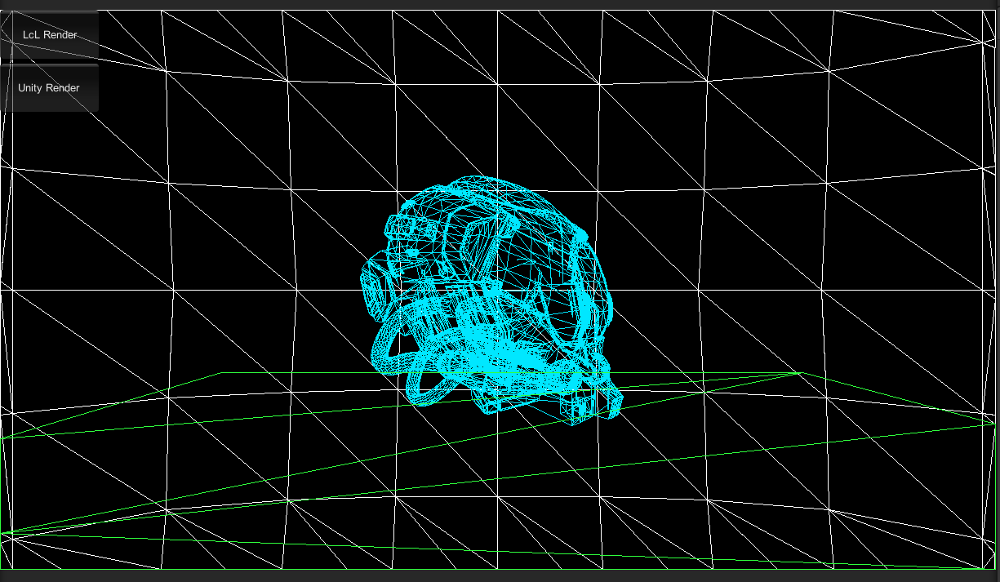

# LcL-Soft-Render

本项目是基于Unity的软光栅化，用于学习与熟悉光栅化。

只用了Unity的模型，纹理加载功能，以及编辑器。其他都是自己代码实现。

## 特性：

1. Custom Shader
2. Back-face culling
3. Frustum Clipping(Sutherland–Hodgman clipping)
4. Perspective Correction Interpolation
5. Depth Test
6. Alpha Tes
7. Alpha Blend
8. CubeMapped Skybox
9. Wireframe Rendering Mode
10. Texture Mapping
11. MSAA
12. Frame Debugger

## 线框模式渲染

## 三角面渲染

 
---

  |
